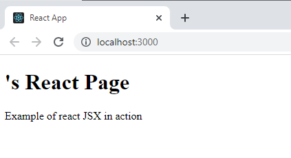
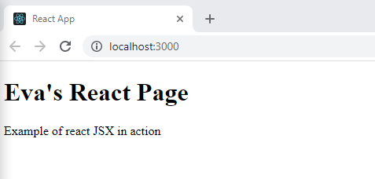
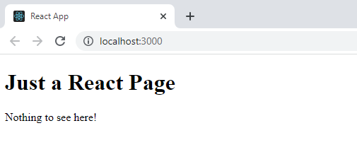

# JSX Components

## Task: Working with JSX Components 

1. Open the folder [task01](task01) in the VS code terminal, run the following command to install the project dependencies:

```Shell
npm install
```

2. To open the application in a browser, run the following command: 

```Shell
npm run dev
```



3. Open the [src/index.jsx](task01/src/index.jsx) file. Update the `Profile()` function. Add an `if` condition. When the variable `name` is populated (i.e. has a defined, non-empty value), the `Profile()` function will return the JSX code below:

```JS
<main id="content" role="main" className="base">
<h1>{name}'s React Page</h1>
	<p>[Your short bio goes here]</p>
</main>
```
_Display the code above if the `name` variable IS POPULATED_

When the variable `name` is **not** populated (i.e. has an undefined, null or empty value), the function will return the JSX code below:

```JS
<main id="content" role="main" className="base">
<h1>Just a React Page</h1>
	<p>Nothing to see here!</p>
</main>
```
_Display the code above if the `name` variable IS UNPOPULATED_

- Example of calling the `Profile(name)` function with a populated `name` variable 'Eva':



- Example of calling the `Profile()` function with no `name` variable:



4. Update the code so the page returns your name and a little bio/description __only if__ the `name` variable matches your name.

1. Try and make sure the logic works regardless of the case of the name variable.

1. For example, if your name is "Eva", then "EVA", "eva" and "evA" should all work.

```JS
<main id="content" role="main" className="base">
<h1>Eva's React Page</h1>
	<p>Short bio and description about Eva goes here.</p>
</main>
```
_The code above is displayed on the page if `const name = 'eVa'`_

## Task: Functional Components Properties

In this task you will:
- Move the `Profile()` function (functional component) created in the previous task into a separate file. 
- Call the `Profile()` functional component using JSX syntax.
- Pass React properties to the Profile JSX component.

1. Open your jsx-components/task02 folder in VS Code

1. Open the folder [task02](task02) in the VS code terminal, run the following command to install the project dependencies:

```Shell
npm install
```

3. Move the `Profile()` function code from the previous task ([task01/src/index.jsx](task01/src/index.jsx)) into the [src/Profile.jsx](task02/src/Profile.jsx) file.

4. Replace the string returned in the [task02/src/index.jsx](task02/src/index.jsx) file with a call to the JSX component. The component should  be called using XML-like syntax, eg. `<Profile /`>`

5. Update the `Profile()` function to take one argument called `props`

    - The `Profile()` function in the previous task had one argument: `name`
    - React functional components have one argument called `props`
    - All attributes passed to functional components can be retrieved from the `props` object

```JS
function Profile(props)
{
 return <main id="content" role="main" className="base">
   <h1>{props.name}'s React Page</h1>
     <p>{props.bio}</p>
 </main>
}
```
6. You will need to pass the properties via the JSX component you called in the index.jsx file e.g. 

```XML
<Profile name="..." bio="..."/>
```

1. Modify the `if` condition in the `Profile()` function so that it returns the `props.name` and `props.bio` properties from the `props` object, but only if the attributes are populated (not empty) on the JSX component.

## Bonus Task: Greetings Form

1. Using JSX components, create a short form that collects a __name__, __short bio__ and has a __submit button__. Add some validation to ensure all fields are mandatory

1. When a name is entered into the input field and submitted, display a greeting and introduction with a JSX Greeting component 

```XML
<Greeting name="" bio="" />
```

